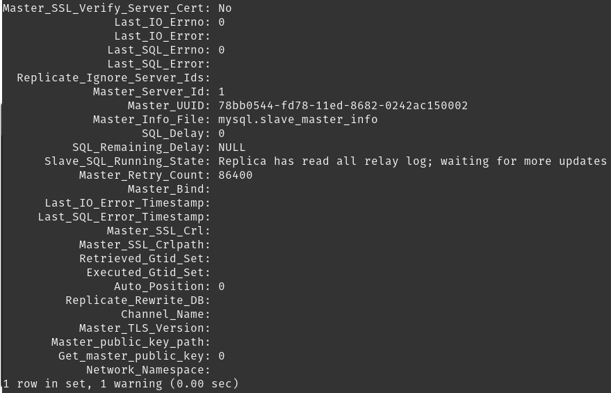
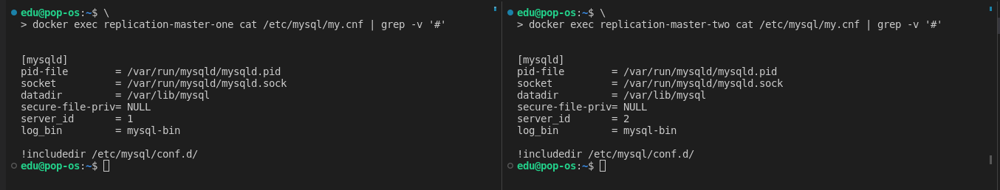

# Домашнее задание к занятию "12.6 - Репликация и масштабирование. Часть 1" - `Андрей Сотников`

---

### Задание 1

> На лекции рассматривались режимы репликации master-slave, master-master, опишите их различия.

Репликация master-slave использует два и более серверов БД, один из которых - master, остальные - slave. В этом случае производить манипуляции с данными можно лишь на мастер сервере, со слейва можно только читать. Слейвы "подтягивают" данные с мастера в автоматическом режиме.

Репликация master-master, по сути, является настройкой master-slave репликации, но в обе стороны, то есть, каждый сервер является и master, и slave одновременно. Таким образом, можно записывать, изменять и удалять данные на обоих серверах, что может привести к негативным последствиям - рассинхронизации и остановке репликации.

---

### Задание 2

> Выполните конфигурацию master-slave репликации, примером можно пользоваться из лекции.

#### Master

my.cnf:  

status:

#### Slave

my.cnf:

status:

Проверка проходит успешно - после INSERT в Master, SELECT в Slave выдает корректные данные.

---

### Задание 3*

> Выполните конфигурацию master-master репликации. Произведите проверку.

my.cnf:

master status:

slave status:

Проверка:

